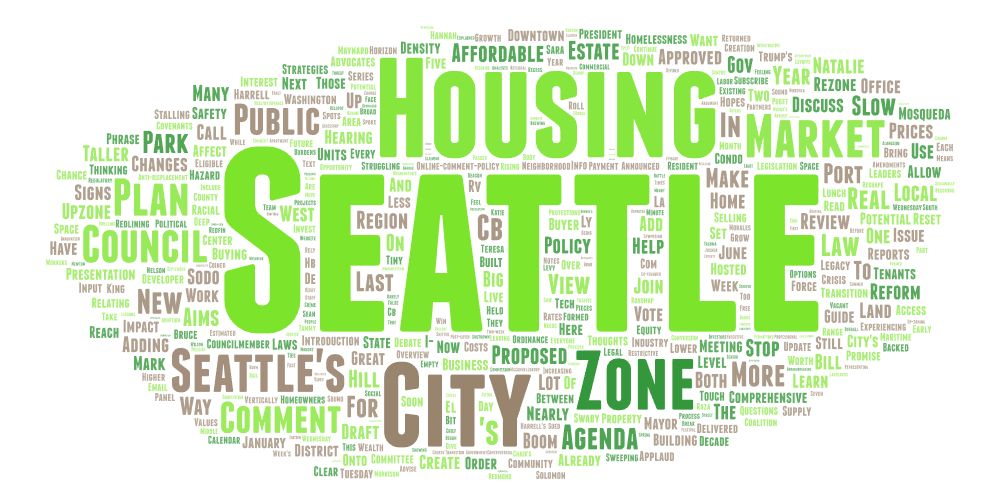
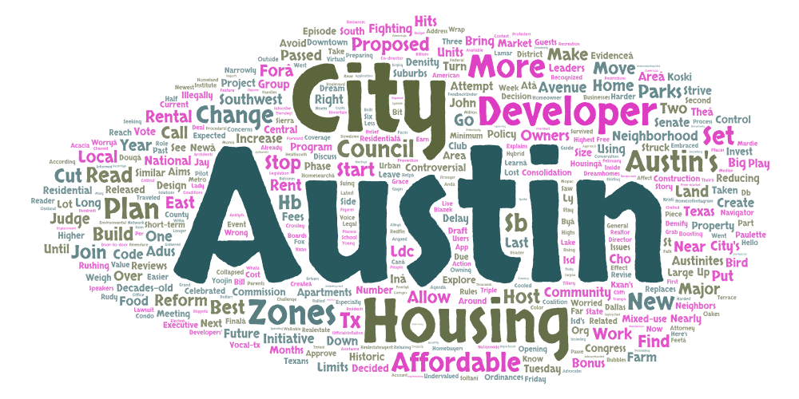

# Lab 2: Web Data Collection and Visualization

## Topic and Search Terms
This lab examines housing affordability and zoning discourse on YouTube by analyzing search results related to housing costs and policy debate between two cities, Seattle, WA and Austin, TX. Data were collected using a Selenium-based crawler that queried YouTube and exported search results to CSV files. Each search term produced a separate CSV, and the word clouds below were generated from the `shortdesc` column of those results.

Search terms used:
- seattle housing crisis
- seattle rent prices
- seattle zoning reform
- austin housing crisis
- austin rent prices
- austin zoning reform

## Why Make This Comparison
A look at Seattle and Austin reveals a shared pulse in urban change talk. Though miles divide them, each city struggles loud and clear with space, cost, and who gets to live where. News coverage bends similar ways when showing new buildings or rent hikes. One spot trends west, the other south, still their rhythm feels like twins separated at birth. Stories shape growth as tension - between old neighborhoods and fresh arrivals. You notice it first in headlines, then deeper down in word choice. Distance fades when listening close to local debate.

## Word Cloud Visualization

## Comparison of the Word Clouds
Housing costs take center stage, tied closely to talk of crisis. Not just one city but both show heavy mention of rent, pricing, and living space shortages. These repeated terms point to real pressure on wallets and access. Affordability isn’t background noise, it shapes much of what viewers see online. The pattern holds firm across locations, even if details differ slightly.

High up near Seattle, clouds seem to whisper about laws, city management, zones shifting ground beneath conversations. Above Austin, the sky pulses with motion. Growth beats loud, construction climbs fast as people pour in, homes struggling to keep pace with sudden surges.

## Possible Reasons for Patterns
Not every change begins with law. Seattle talks through rules because old fights over land use still echo there. Instead of quick fixes, answers often hide in policy talk shaped by years of debate. Growth sneaks into Austin on waves of people moving in, builders rushing up apartments, prices shifting fast. Because of that, what gets said about homes ties back to cranes, markets, who shows up next. The way leaders act, what projects move forward, even past choices - they all twist the story told online depending on the city.

## Unexpected Findings
It stands out how two cities, though shaped by separate policies and plans, still finds a common ground when talking about emergencies. Housing struggles aren’t just local talk anymore - they’ve turned into a common story, even where conditions differ.

## Limitations and Future Improvements
Looking at just the short summaries from searches might skip deeper meaning found in the actual videos. A step further could mean pulling in full video words, info about who posted, or sorting by when things appeared. Another path opens up by checking more towns or using set word rules to make comparisons stronger.

## Download Links to CSV Data
- [Seattle housing crisis](assets/search-result-seattle_housing_crisis.csv)
- [Seattle rent prices](assets/search-result-seattle_rent_prices.csv)
- [Seattle zoning reform](assets/search-result-seattle_zoning_reform.csv)
- [Austin housing crisis](assets/search-result-austin_housing_crisis.csv)
- [Austin rent prices](assets/search-result-austin_rent_prices.csv)
- [Austin zoning reform](assets/search-result-austin_zoning_reform.csv)
